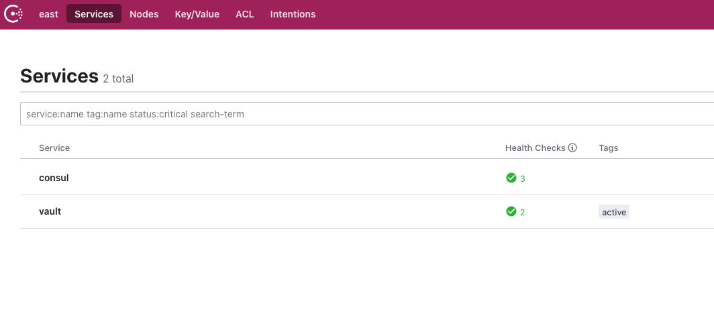
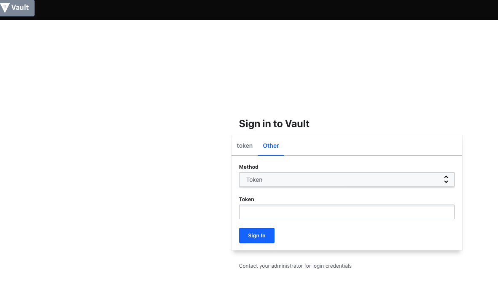

# vault-consul-vagrant
Example of Vault with Consul cluster as backend on Vagrant

# Requirements
- [Vagrant](https://www.vagrantup.com/)
- [Consul](https://www.consul.io/)
- [Vault](https://www.vaultproject.io/)

# How to consume

```bash
git clone git@github.com:andrewpopa/vault-consul-vagrant.git
cd vault-consul-vagrant
vagrant up
```

as result of you should have 4 VMs running

```bash
$ vagrant status
Current machine states:

consul1                   running (virtualbox)
consul2                   running (virtualbox)
consul3                   running (virtualbox)
vault                     running (virtualbox)
```

consul nodes will join into cluster and vault will use it as backend.

## Manual step

login to vault server to unseal it. for the demo purpose only 1 unseal key will be generated and store in txt file.

`Do NOT do it for production environment`

```bash
export VAULT_ADDR=http://127.0.0.1:8200
vault operator init -key-shares=1 -key-threshold=1 > init.txt
vault operator unseal $(cat init.txt | grep -i "unseal key [1]" | awk '{ print $4}')
```

make sure it's running correctly 

```bash
$ vault status
Key             Value
---             -----
Seal Type       shamir
Initialized     true
Sealed          false
Total Shares    1
Threshold       1
Version         1.4.2
Cluster Name    vault-cluster-fa3c4198
Cluster ID      60fcab67-9183-7512-d5e0-4349311b636c
HA Enabled      true
HA Cluster      https://192.168.178.40:8201
HA Mode         active
```

## Consul & Vault

as result you'll have Consul available



Vault server unsealed where you can login with root token generated in `init.txt`

